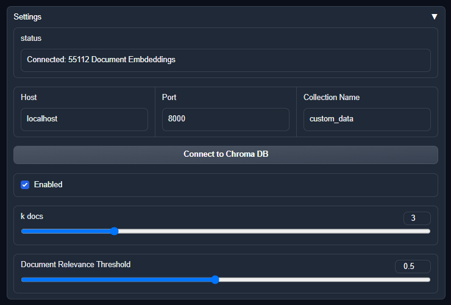

# Overview

This extension designed to enhance the capabilities of the [Text Generation Web UI](https://github.com/oobabooga/text-generation-webui). It provides a simple user interface for fetching and incorporating additional contextual information in a user's input to the selected LLM. 




## UI Components

- **ChromaDB Connection Settings:** Configure the connection parameters to ChromaDB, including host, port, and collection name.

- **Enabled:** Toggle the extension's ability to append contextual information to user input before sending it to the language model.

- **Result Limit (K):** Set the maximum number of contextual documents to be fetched and integrated into the model.

- **Relevance Threshold** - Establish the minimum score a document must meet to be considered relevant to the original input.

- **Connect to Chroma DB**: Initiates a connection to the ChromaDB server based on the settings provided.


## Prerequisites
The functionality of this extension assumes the availability of a live ChromaDB server. For additional details on ChromaDB, please refer to the [Chroma Usage Guide](https://docs.trychroma.com/usage-guide) and the [ChromaDB GitHub]( https://github.com/chroma-core/chroma).

**Quick Local Setup:**  
To run ChromaDB locally, clone the repository and execute the following Docker command:

```docker-compose up -d --build```

Ensure you've also installed the python dependcies from the requirements.txt file. The extension cannot function without them. 


## Data Ingestion
### Chroma Ingestion Script (chroma-ingest.py)

This extension includes a Python script, loader\chroma-ingest.py, designed to populate a running instance of ChromaDB with document embeddings.

**Usage**  
- Ensure ChromaDB is running, as per the prerequisites section.  
- To ingest data from specific directories into ChromaDB, execute the following command:  


```python
python loader\chroma-ingest.py --source-dirs <space delimited directory list>

# Example 
# python loader\chroma-ingest.py --source-dirs C:\pdfs C:\notes\ C:\random_text_files
```

## Credit
Portions of this codebase were inspired by:
- [LocalGPT](https://github.com/PromtEngineer/localGPT)